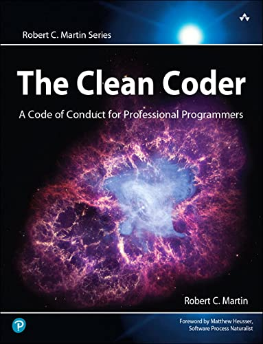

# The Clean Coder: A Code of Conduct for Professional Programmers

## Summary

This book contains advice on many behavioural practices a software engineer should have in order to call him/herself a
professional. Uncle Bob goes from taking responsibility of your mistakes and your career, to knowing when and how to say
yes and no, and the implications that this conveys.

## Notes

### Chapter 01: Professionalism

- **Taking responsibility:** Always make sure that you are a responsible engineer, don't try to save your face. Be
  concerned about your customers and your employer. Don't put your reputation over your responsibilities. Communicate
  issues before they become unmanageable, if work is delayed say it as soon as you know, this is hard to do and maybe
  your boss will be upset. No customer would have broken features or encounter bugs that might put in risk their.
  business.

- **Do no harm:** There are two ways where you can do harm to software, harm the **function** or the **structure**, the
  former means DO NOT CREATE BUGS and TEST. This might be a little unreasonable for some. For example when you are
  hiring a professional you expect them to understand their field in its entirety don't we, we don't expect doctors
  saying: well human body is too complex. We must be responsible for our imperfections, apologize for your mistakes, and
  make everything in your power to not make the same mistake again. Something that will help you to achieve better error
  rate is automated testing, make sure that your features are tested, and run those tests often. When we talk about
  structure we talk about making sure that our code stays _easy to change_ throughout the whole lifecycle of the
  project, in order to ensure this, you need to change code. Force yourself to refactor, never let your code to stay
  static. Static code is hard to change because its never been flexed. How do you feel safe that your changes are
  correct, well back to testing, automate your tests, make sure to run them, and keep them flexible and clean.

- **Work ethic:** Your career is _your responsibility!_. Period. There might be employers that buy you books, send you
  to conferences, give you time to learn, all of this is great and appreciated, but it shouldn't be expected. If there
  is no time at work to stay relevant, you'll need to find that time elsewhere. Make this time fun, learn about
  technologies that you enjoy, or learn a new language, maybe start a personal pet project. You as a professional need
  to know your field, you need to know the tools in order to do your job professionally some basic things would be:
  Design patterns, Design principles (SOLID, 4RSD, etc...), Methodologies (Scrum, Kanban, Waterfall), Disciplines (TDD,
  OOP, FP, Pair programming), and Artifacts (UML, Structure Charts, State Transition Diagrams and Tables, etc...).
  > Stay learning, stay practicing.
